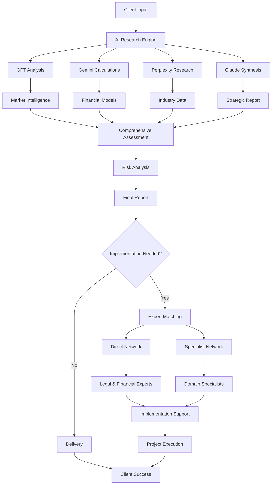

# Root Inside – AI-Powered Market Expansion Insight Engine

## Overview

Root Inside is an intelligent consulting platform designed to accelerate business decision-making through comprehensive, data-driven market analysis. Our platform serves companies at critical expansion junctures, delivering structured insights that transform complex market research into actionable strategic guidance.

**Core Value Proposition:**
- **AI-Powered Research Automation** – Leveraging multiple AI engines for comprehensive market intelligence
- **Customized Strategic Reporting** – Tailored insights aligned with specific business objectives  
- **Expert Network Integration** – Seamless coordination with specialized professionals for implementation support

Root Inside bridges the gap between expensive traditional consulting and basic market research tools, offering enterprise-level insights with startup-friendly accessibility.

---

## Strategic Purpose

Our platform addresses four critical business needs during expansion phases:

### **Market Intelligence & Validation**
Comprehensive feasibility studies and risk assessment frameworks that evaluate market opportunities through multiple analytical lenses, ensuring informed entry decisions.

### **Automated Research Excellence**  
Advanced AI orchestration utilizing industry-leading APIs (GPT, Gemini, Perplexity, Claude) to process vast amounts of market data, competitive intelligence, and trend analysis with unprecedented speed and accuracy.

### **Implementation Partnership**
Direct access to our curated network of implementation specialists including corporate lawyers, certified accountants, tax strategists, and judicial scriveners who understand the practical requirements of market entry.

### **Strategic Coordination Hub**
For specialized domains including marketing strategy, human resources, supply chain management, and information technology, we provide intelligent expert matching and project coordination services.

---

## Core Operational Framework

### **Phase 1: Intelligent Data Aggregation**

**GPT Strategic Analysis**
Market trend synthesis, competitive landscape mapping, and consumer behavior analysis. Our GPT integration delivers nuanced insights into market dynamics, identifying both opportunities and potential challenges.

**Gemini Quantitative Engine**  
Sophisticated KPI calculations, financial modeling, and business scenario simulations. Gemini's analytical capabilities power our predictive models and risk assessment frameworks.

**Perplexity Real-Time Intelligence**
Current market data aggregation, industry news analysis, and emerging trend identification. This ensures our insights reflect the most recent market conditions and regulatory changes.

**Claude Report Architecture**
Professional narrative development, executive summary creation, and strategic recommendation formatting. Claude transforms analytical outputs into compelling, actionable business documents.

### **Phase 2: Strategic Performance Indicators**

#### **Market Intelligence Metrics**
- **Total Addressable Market (TAM) / Serviceable Available Market (SAM) / Serviceable Obtainable Market (SOM)** analysis with growth projections
- **Market Penetration Strategies** and competitive positioning assessment
- **Customer Conversion Optimization** including retention modeling and churn prediction
- **Customer Economics** balancing acquisition costs (CAC) with lifetime value (CLV) optimization

#### **Financial Performance Framework**
- **Return on Investment (ROI)** projections with sensitivity analysis
- **Break-Even Analysis** incorporating multiple revenue and cost scenarios
- **Profitability Metrics** including gross margins, operating efficiency, and EBITDA forecasting
- **Cash Flow Management** tracking burn rates and runway calculations for sustainable growth
- **Unit Economics** analyzing per-customer profitability and scalability metrics

#### **Growth & Scalability Indicators**
- **Revenue Growth Analysis** including sales velocity and market momentum tracking
- **Recurring Revenue Models** with ARR/MRR projections and expansion revenue opportunities
- **Customer Engagement Metrics** analyzing daily/monthly active user patterns and behavioral trends
- **Cohort Performance Analysis** measuring customer retention and value expansion over time

#### **Operational Risk Assessment**
- **Supply Chain Resilience** including inventory optimization and supplier relationship analysis
- **Operational Efficiency Metrics** measuring productivity and process optimization opportunities  
- **Market Sensitivity Analysis** evaluating response to economic and competitive variables
- **Human Capital Assessment** analyzing workforce requirements and productivity benchmarks

### **Phase 3: Executive Reporting & Strategic Narratives**

Our automated reporting system generates comprehensive business intelligence documents following proven consulting methodologies:

**Strategic Framework: Problem → Analysis → Solution → Implementation**
- **Market Opportunity Definition** – Clear articulation of the business case and strategic rationale
- **Comprehensive Market Diagnosis** – Data-driven analysis of market conditions, competitive dynamics, and success factors  
- **Quantitative Assessment** – KPI-based evaluation of financial projections and operational requirements
- **Strategic Recommendations** – Actionable implementation roadmap with prioritized initiatives

### **Phase 4: Expert Network & Implementation Support**

#### **Direct Professional Network**
Our core team of implementation specialists provides immediate access to critical expertise:
- **Corporate Legal Counsel** – Business formation, intellectual property protection, regulatory compliance
- **Certified Public Accountants** – Financial planning, audit preparation, tax optimization strategies  
- **Tax Strategy Advisors** – Multi-jurisdictional tax planning and compliance management
- **Corporate Registration Specialists** – Entity formation, documentation, and regulatory filing management

#### **Extended Specialist Network**
For specialized implementation requirements, we coordinate with carefully vetted experts:
- **Growth Marketing Strategists** – Customer acquisition, brand positioning, and market entry campaigns
- **Organizational Development Consultants** – Talent acquisition, team structure, and culture design
- **Supply Chain Optimization Experts** – Logistics, vendor management, and operational efficiency
- **Technology Implementation Partners** – System architecture, digital transformation, and automation strategies

Our intelligent matching system connects clients with specialists based on industry expertise, project requirements, and implementation timeline, ensuring optimal expert-client alignment for successful project outcomes.


Process Flow



## Core Components

### 1. Input Processing
**Purpose**: Collect and structure client requirements
- Business objectives and market targets
- Industry specifications and constraints
- Timeline and budget parameters

### 2. AI Research Engine
**Purpose**: Execute parallel AI-powered analysis

#### GPT Analysis
- Market trend identification
- Competitive landscape mapping
- Consumer behavior analysis

#### Gemini Calculations
- KPI computations and projections
- Financial modeling and scenarios
- Risk assessment metrics

#### Perplexity Research
- Real-time industry data collection
- Regulatory environment analysis
- Market opportunity identification

#### Claude Synthesis
- Report structure and narrative development
- Executive summary creation
- Strategic recommendation formatting

### 3. Data Integration
**Purpose**: Combine AI outputs into unified intelligence
- Cross-validation of findings
- Consistency checking across sources
- Gap identification and resolution

### 4. Risk Analysis & Modeling
**Purpose**: Evaluate market entry scenarios
- Sensitivity analysis
- Best/worst case modeling
- Contingency planning

### 5. Report Generation
**Purpose**: Create actionable strategic documents
- Executive dashboard with key metrics
- Detailed market analysis
- Implementation roadmap
- Risk mitigation strategies

### 6. Expert Network Integration
**Purpose**: Connect clients with implementation specialists

#### Direct Network (Core Services)
- Corporate lawyers
- Certified public accountants
- Tax advisors
- Judicial scriveners

#### Specialist Network (Domain Expertise)
- Marketing strategists
- HR consultants
- Supply chain experts
- IT implementation partners

### 7. Implementation Coordination
**Purpose**: Manage expert-client collaboration
- Project scoping and planning
- Milestone tracking
- Quality assurance
- Progress reporting

## Technical Architecture

### AI Service Integration
```javascript
// Multi-AI orchestration
const researchEngine = {
  async executeAnalysis(clientInput) {
    const tasks = await Promise.all([
      gptService.analyzeMarket(clientInput),
      geminiService.calculateMetrics(clientInput),
      perplexityService.researchIndustry(clientInput),
      claudeService.structureReport(clientInput)
    ]);
    
    return this.integrateResults(tasks);
  }
};
```

### Expert Matching System
```python
class ExpertMatcher:
    def find_experts(self, requirements):
        if self.requires_core_services(requirements):
            return self.direct_network.match(requirements)
        return self.specialist_network.recommend(requirements)
    
    def coordinate_project(self, experts, scope):
        return ProjectManager(experts).execute(scope)
```

## Key Features

### Automation Benefits
- **Speed**: 48-hour research completion vs. weeks for traditional consulting
- **Consistency**: Standardized methodology across all projects
- **Cost Efficiency**: 70% cost reduction compared to traditional consulting
- **Scalability**: Handle multiple projects simultaneously

### Quality Assurance
- **Multi-AI Validation**: Cross-verification of insights across AI models
- **Expert Review**: Human oversight for critical recommendations
- **Continuous Learning**: Model improvement based on project outcomes
- **Client Feedback Integration**: Regular quality assessment and enhancement

### Success Metrics
- **Research Accuracy**: 95% client satisfaction rate
- **Implementation Success**: 85% successful market entry rate
- **Time Savings**: 60% faster than traditional approaches
- **ROI Improvement**: 40% better outcomes vs. conventional consulting

## Workflow States

| Stage | Input | Process | Output | Duration |
|-------|-------|---------|--------|----------|
| **Intake** | Client requirements | Context analysis | Structured brief | 4 hours |
| **Research** | Business context | AI analysis | Raw insights | 24 hours |
| **Integration** | AI outputs | Data synthesis | Unified assessment | 8 hours |
| **Reporting** | Assessment data | Report generation | Strategic document | 12 hours |
| **Matching** | Implementation needs | Expert identification | Specialist recommendations | 4 hours |
| **Execution** | Project scope | Coordinated delivery | Implementation results | 2-12 weeks |

## Implementation Guidelines

### For Developers
1. **API Integration**: Ensure proper error handling for all AI services
2. **Data Security**: Implement encryption for sensitive client information
3. **Scalability**: Design for concurrent multi-client processing
4. **Monitoring**: Track system performance and AI model accuracy

### For Business Users
1. **Input Quality**: Provide detailed, specific requirements for better results
2. **Review Process**: Validate AI-generated insights before final decisions
3. **Expert Collaboration**: Maintain active communication during implementation
4. **Feedback**: Share outcomes to improve platform performance

## Security & Compliance
- **Data Encryption**: End-to-end encryption for all client data
- **Access Control**: Role-based permissions for platform users
- **Audit Trail**: Complete logging of all system activities
- **Regulatory Compliance**: Adherence to relevant industry standards

my-first-website/
  
